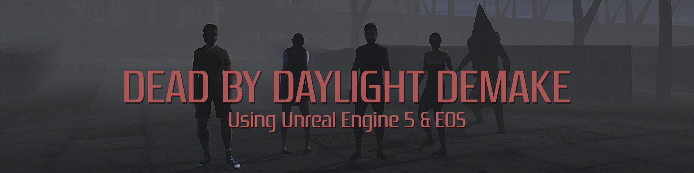
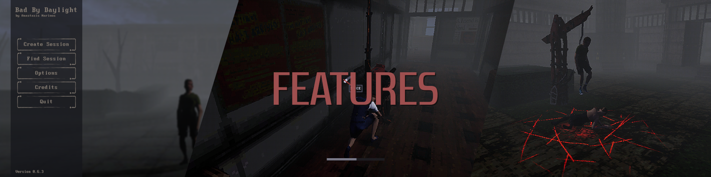
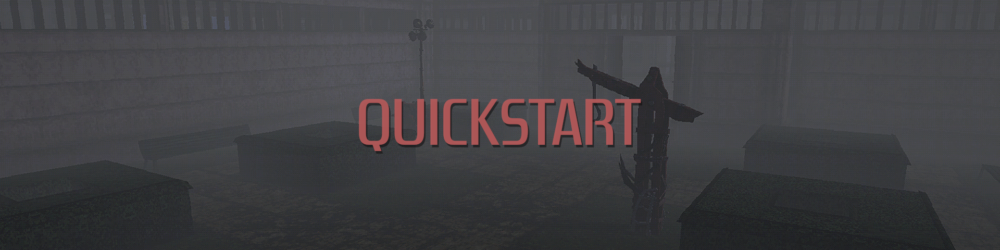

# Dead by Daylight Clone

> A UE5, EOS-powered asymmetrical horror prototype. Survivors repair generators to power the exit and escape; the Killer hunts, injures, carries and hooks them. Built to evolve into a clean **asymmetrical horror template**.



**Engine:** Unreal Engine 5.4  
**Networking:** Epic Online Services (Presence + Lobbies)  
**Architecture:** Server-authoritative (Listen Server)  
**Status:** Prototype / WIP  
**Style:** PSX / Lo-Fi Horror

---

## Technical Highlights

- Server-authoritative multiplayer architecture
- Custom replicated state machines (health / hook / generator)
- Montage replication using server timestamps
- Custom SavedMove flags for movement states (sprint / crawl / stun)
- Clean separation of GameMode / GameState / Controller responsibilities

## What This Project Demonstrates

- Multiplayer gameplay programming in UE5
- Custom interaction systems
- Gameplay state synchronization
- Network-safe UI update patterns

---

## Features



- **Core asymmetrical loop**
  - Survivors repair **Generators** → power **Exit Gate Lever** → escape
  - Killer injures, **carries**, and **hooks** survivors; can **kick/break generators**
- **Survivor health system**
  - `Healthy → Injured → Crawling → Carried/Hooked`
  - **Wiggle** to break free from carry; **Hook** has multi-stage progression (Hooked → Struggling)
  - **Heal others** and **self-recover** while crawling
- **Skill Checks**
  - Time-window minigame during repairs with **Great/Success/Fail** outcomes (FX + penalties)
- **Networked gameplay**
  - Server authoritative; curated replication (booleans/progress/state)
  - **Montage replication with server timestamps** for better sync
  - Multicast **VFX/SFX** for explosions, breaks, hits, etc.
- **EOS Sessions**
  - **Create / Destroy / Find / Join** via `UEOSGameInstance`
  - Lobby travel, presence, lobbies-if-available enabled

---

## Quickstart



### Prerequisites
- **Unreal Engine 5.4**
- Windows + Visual Studio / Rider
- Enable plugins: **Online Subsystem**, **Online Subsystem EOS**, **EOS Shared**

### Clone & Open
```bash
git clone <your-repo-url>
cd <repo>
# Open the .uproject file with Unreal Engine 5.4.
```

### Maps
- **Main Menu:** `/Game/Maps/M_MainMenu`  
- **Lobby:** `/Game/Maps/M_Lobby`  
- **Gameplay:** `/Game/Maps/M_MidwichElementary`

> The host creates an EOS session and travels to the **Lobby** (`listen`), then clients join through EOS.

---

## Epic Online Services (Sessions)

Enable **OnlineSubsystemEOS** in Plugins, then add your credentials to `Config/DefaultEngine.ini`. Use your own IDs from the EOS Dev Portal:

```ini
[OnlineSubsystem]
DefaultPlatformService=EOS

[OnlineSubsystemEOS]
bUseEAS=false
bUseEOSConnect=true
bUseLobby=true
bUseP2PSockets=true

[OnlineSubsystemEOS.DevAuth]
# Dev auth via Account Portal (matches code)
LoginType=accountportal

[OnlineSubsystemEOS.ProductSettings]
ProductId=<YOUR_PRODUCT_ID>
SandboxId=<YOUR_SANDBOX_ID>
DeploymentId=<YOUR_DEPLOYMENT_ID>
ClientId=<YOUR_CLIENT_ID>
ClientSecret=<YOUR_CLIENT_SECRET>
```

**Flow in code:**  
`UEOSGameInstance` logs in via **accountportal**, exposes `CreateSession / FindSessions / JoinSession / DestroySession`, and travels to **/Game/Maps/M_Lobby** on successful create. On destroy (match end) it returns to **M_MainMenu**.

---

## Project Structure (key classes)

- **Characters**
  - `ASurvivorCharacter` — movement, interaction/health wiring, UI RPCs, montage replication
  - `AKillerCharacter` — first-person setup, attack/trace, carry/hook flow, montage replication
- **Components**
  - `USurvivorInteractionComponent` — server-owned interaction state & ticking
  - `USurvivorHealthComponent` — state machine, timers, UI progress, death routing
  - `USurvivorMovementComponent` / `UKillerMovementComponent` — sprint/crawl/stun (**SavedMove** flags)
  - `USkillCheckComponent` — timers & delegates for Great/Success/Fail
- **World Actors**
  - `AGenerator`, `AExitGateLever`, `AHook`
- **Game Flow**
  - `APlayerGameMode` — pawn assignment (Killer vs Survivor), display name init
  - `APlayerGameState` — replicated counters, match end logic
  - `APlayerCharacterController` — input mapping, HUD creation, input→pawn forwarding
  - `UEOSGameInstance` — EOS login & sessions; travel to Lobby/Main Menu

---

## Gameplay Notes

- **Generators (`AGenerator`)**
  - Server tracks `CurrentRepairValue` (replicated)
  - **Explode / Break** reduce progress; **Completed** flips a light & increments `GeneratorsRepaired` in GameState
  - FX/SFX via **NetMulticast**
- **Exit Gate Lever (`AExitGateLever`)**
  - Powers up after enough repaired generators, then calls `APlayerGameState::OnExitGatePowered()` (survivor win)
- **Health (`USurvivorHealthComponent`)**
  - Replicates **HealthState**, **HookState**, and progress for **healing / wiggle / hook**
  - Drives UI by pushing progress to the owner via client RPCs (server decides when to show/hide)
  - Handles **death**: swaps to Spectator, notifies GameState to count eliminations
- **Interactions (`USurvivorInteractionComponent`)**
  - Server-side overlap evaluation (Generator / ExitGate / Survivor / Hooked target)
  - Centralized **Begin/End** flows: **Repair**, **Power**, **Heal Other**, **Heal Self**, **Unhook**
  - Periodically pushes a 0..1 **progress** value to the owning client UI
- **Match flow (`APlayerGameState`)**
  - Tracks **Survivors** list, **AliveSurvivorCount**, **GeneratorsRepaired**
  - Ends match on: **All survivors eliminated** (Killer Win) or **Exit powered** (Survivors Win)
  - Multicasts return-to-menu + asks `UEOSGameInstance` to destroy the session on host

---

## Controls

### Survivor
- **Move / Look:** `WASD` + `Mouse`  
- **Sprint:** `Left Shift`  
- **Crouch:** `Left Ctrl`  
- **Interact (repair/power/heal/unhook):** `LMB`  
- **Action (wiggle / skill check):** `Space`

### Killer
- **Move / Look:** `WASD` + `Mouse`  
- **Attack:** `LMB`  
- **Action (carry / hook / interact):** `Space`  

*(Bindings use **Enhanced Input** assets like `IA_Move`, `IA_Look`, `IA_Interact`, `IA_Action`.)*

---

## Roadmap

- Replace/remove copyrighted content (**original map** + **original killer**)
- Polish Multiplayer System
- Finish Documentation

---

## Credits

- Code & design: **Anastasis Marinos**  
- Tools/libs: Unreal Engine, Epic Online Services, Blender, Gimp 
- Third-party/copyrighted content used only for prototyping (see **Legal Notice**)

---

- ## Legal Notice

This prototype currently uses placeholder third-party assets for rapid iteration.
These will be replaced with original content before any public distribution.

This repository is intended for code review and portfolio evaluation only.

---

## Contact

- **https://anastasismarinos.com**
